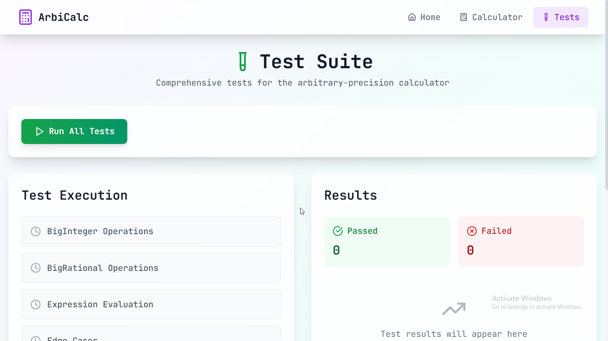

# Arbitrary-Precision Integer Calculator

## Overview

This project implements a **comprehensive arbitrary-precision integer calculator** with both command-line and modern web interfaces. The calculator is built from scratch without relying on external libraries for core mathematical operations, featuring its own classes for handling big integers and rational numbers, along with a recursive descent parser and evaluator. The project includes a **React-based web interface**, **comprehensive test suite**, and **deployment-ready configuration**.

## 🌐 Live Demo

**[https://apicalculator-v2.netlify.app/](https://apicalculator-v2.netlify.app/)**

## Features

### Core Mathematical Capabilities
- **Arbitrary-Precision Integers**: Supports integers of any size limited only by available memory
- **Basic Arithmetic Operations**: Addition (`+`), subtraction (`-`), multiplication (`*`), division (`/`), modulo (`%`), and exponentiation (`^`)
- **Factorial Operator**: Computes factorials using the `!` operator
- **Fractions Support**: Handles rational numbers through a custom `BigRational` class with automatic simplification
- **Advanced Functions**: Natural logarithm (`ln()`), common logarithm (`log()`), square root (`sqrt()`), absolute value (`abs()`)
- **Operator Precedence and Associativity**: Correctly parses expressions respecting mathematical operator precedence
- **Parentheses Support**: Full support for grouping expressions using parentheses

### Web Interface
- **Modern React Frontend**: Built with React 18, TypeScript, and Tailwind CSS
- **Interactive Calculator**: Visual keypad with syntax highlighting and real-time expression formatting
- **Calculation History**: Persistent history with timestamps and easy result copying
- **Responsive Design**: Optimized for desktop and mobile devices
- **Purple/Teal Theme**: Professional color scheme with glass morphism effects
- **Syntax Highlighting**: Color-coded mathematical expressions for better readability

### Testing & Quality Assurance
- **Comprehensive Test Suite**: Covers BigInteger operations, BigRational operations, expression evaluation, and edge cases
- **Web-Based Test Runner**: Interactive test execution with real-time results and performance metrics
- **Automated Testing**: Both command-line and web-based test execution
- **Performance Monitoring**: Test duration tracking and success rate analytics

### Deployment & Architecture
- **Dual Backend Support**: Python HTTP server for full functionality, JavaScript fallback for demo deployment
- **Smart Fallback System**: Automatically switches to client-side calculations when backend is unavailable
- **Netlify Deployment**: Production-ready deployment configuration with build optimization
- **Progressive Enhancement**: Full functionality maintained regardless of backend availability

## Technology Stack

### Backend
- **Python 3**: Core calculator implementation with custom BigInteger and BigRational classes
- **HTTP Server**: RESTful API server for calculator operations and test execution
- **Zero Dependencies**: Pure Python implementation without external mathematical libraries

### Frontend
- **React 18**: Modern component-based UI framework
- **TypeScript**: Type-safe JavaScript with full type coverage
- **Tailwind CSS**: Utility-first CSS framework with custom design system
- **Vite**: Fast build tool and development server
- **React Router**: Client-side routing for multi-page application
- **Lucide React**: Modern icon library

### Development & Deployment
- **Concurrently**: Simultaneous frontend and backend development
- **Netlify**: Static site hosting with automatic deployments
- **ESLint**: Code quality and consistency enforcement
- **PostCSS & Autoprefixer**: CSS processing and browser compatibility

## Project Structure

```
├── calc.py                 # Core calculator implementation
├── server.py              # Python HTTP API server
├── test_calc.py           # Comprehensive test suite
├── src/
│   ├── components/        # React components
│   │   ├── CalculatorDisplay.tsx
│   │   ├── CalculatorKeypad.tsx
│   │   ├── HistoryPanel.tsx
│   │   ├── Navigation.tsx
│   │   ├── TestRunner.tsx
│   │   └── TestResults.tsx
│   ├── pages/            # Application pages
│   │   ├── HomePage.tsx
│   │   ├── CalculatorPage.tsx
│   │   └── TestPage.tsx
│   ├── services/         # API and mock services
│   │   └── mockApi.ts
│   └── App.tsx           # Main application component
├── dist/                 # Production build output
├── screenshots/          # Documentation images
└── docs/                # Additional documentation
```

## Installation & Setup

### Prerequisites
- **Node.js 18+** and **npm 9+**
- **Python 3.8+**

### Development Setup

1. **Clone the repository**:
   ```bash
   git clone <repository-url>
   cd calculator-app
   ```

2. **Install dependencies**:
   ```bash
   npm install
   ```

3. **Start development servers**:
   ```bash
   npm run dev
   ```
   This starts both the Python backend (port 8000) and React frontend (port 5173)

4. **Access the application**:
   - Web Interface: `http://localhost:5173`
   - API Server: `http://localhost:8000`

### Production Build

```bash
npm run build
```

## Usage

### Web Interface

1. **Calculator Page**: Interactive calculator with visual keypad
   - Enter expressions using the keypad or keyboard
   - View real-time syntax highlighting
   - Access calculation history
   - Copy results with one click

2. **Test Page**: Comprehensive test suite execution
   - Run all tests with detailed results
   - View performance metrics
   - Monitor test coverage

3. **Home Page**: Feature overview and navigation

### Command Line Interface

```bash
python calc.py
```

**Example calculations**:
```
> 123456789012345678901234567890 * 987654321098765432109876543210
> 20!
> 2^64
> 1/2 + 3/4
> ln(2)
> sqrt(16)
```

### API Endpoints

- **POST /calculate**: Evaluate mathematical expressions
- **POST /test**: Execute test suite and return results

## Implementation Details

### BigInteger Class
- **String-based representation** for unlimited precision
- **Optimized algorithms** for all arithmetic operations
- **Sign handling** and **comparison operators**
- **Exponentiation by squaring** for efficient power calculations

### BigRational Class
- **Automatic fraction simplification** using GCD
- **Decimal conversion** with repeating decimal detection
- **Mixed arithmetic** with integers and rationals
- **Precision preservation** throughout calculations

### Parser & Evaluator
- **Recursive descent parser** with proper operator precedence
- **Abstract Syntax Tree (AST)** construction and evaluation
- **Function call support** with parameter validation
- **Error handling** with descriptive messages

### Web Architecture
- **Component-based design** with clear separation of concerns
- **State management** using React hooks
- **API abstraction** with automatic fallback
- **Responsive layout** with mobile-first approach

## Testing

### Test Coverage
- **BigInteger Operations**: All arithmetic operations and edge cases
- **BigRational Operations**: Fraction handling and simplification
- **Expression Evaluation**: Complex expressions and function calls
- **Edge Cases**: Zero operations, negative numbers, large numbers

### Running Tests

**Command Line**:
```bash
python test_calc.py
```

**Web Interface**:
Navigate to `/test` and click "Run All Tests"

## Deployment

### Live Deployment
The application is deployed at: **[https://apicalculator-v2.netlify.app/](https://apicalculator-v2.netlify.app/)**

### Deployment Features
- **Automatic fallback** to client-side calculations
- **Full functionality** maintained in demo mode
- **Progressive enhancement** for optimal user experience
- **Static site optimization** for fast loading

### Manual Deployment

1. **Build the project**:
   ```bash
   npm run build:frontend
   ```

2. **Deploy to Netlify**:
   - Connect repository to Netlify
   - Set build command: `npm run build:frontend`
   - Set publish directory: `dist`

## Screenshots

### Calculator Interface

*Interactive calculator with syntax highlighting and history*


*Complex calculations with fraction and decimal results*

### Test Suite

*Comprehensive test suite with real-time execution*


*Detailed test results with performance metrics*

### Dashboard

*Modern homepage with feature overview*

## Performance Characteristics

- **Memory Efficient**: String-based number representation
- **Scalable**: Handles arbitrarily large numbers
- **Fast Operations**: Optimized algorithms for common operations
- **Responsive UI**: Smooth interactions with 60fps animations

## Browser Compatibility

- **Modern Browsers**: Chrome 90+, Firefox 88+, Safari 14+, Edge 90+
- **Mobile Support**: iOS Safari, Chrome Mobile, Samsung Internet
- **Progressive Enhancement**: Graceful degradation for older browsers

## Contributing

1. Fork the repository
2. Create a feature branch
3. Make your changes
4. Add tests for new functionality
5. Ensure all tests pass
6. Submit a pull request

## License

MIT License - see [LICENSE](LICENSE) file for details.

## Acknowledgments

- Built as a demonstration of fundamental computer science algorithms
- Implements arbitrary-precision arithmetic without external dependencies
- Showcases modern web development practices with React and TypeScript
- Provides educational value for understanding mathematical computation

---

**Note**: This calculator demonstrates the implementation of arbitrary-precision arithmetic from first principles, making it an excellent educational tool for understanding how mathematical operations work at a fundamental level while providing a production-ready web application.